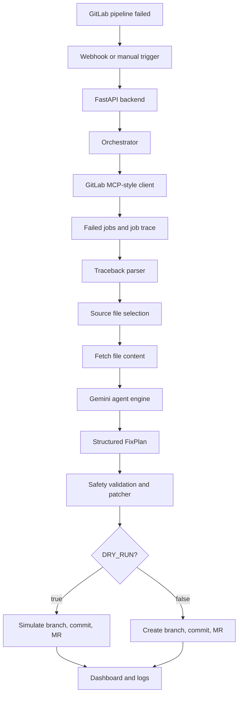

# SyntaxSentinel

Autonomous CI/CD Pipeline Healing Agent for GitLab.

SyntaxSentinel is an AI-assisted DevOps automation prototype that investigates failed GitLab CI/CD pipelines, diagnoses the root cause with Gemini on Google Cloud, prepares a minimal fix plan, validates safety constraints, and opens a human-reviewable Merge Request.

It is designed as a portfolio-grade MVP for learning and demonstrating applied AI agents in real developer workflows. The agent does not auto-merge changes. Human review remains the final approval step.

## What It Does

When a GitLab pipeline fails, SyntaxSentinel can:

1. Receive a GitLab webhook or manual trigger.
2. Fetch failed pipeline jobs from GitLab.
3. Read the failed job trace.
4. Extract Python error details and candidate file paths.
5. Fetch the related source file from the repository.
6. Ask Gemini to produce a structured fix plan.
7. Validate confidence, risk level, file scope, and patch size.
8. Create a fix branch, commit, and Merge Request.
9. Keep all writes simulated when `DRY_RUN=true`.

## Why This Project Exists

Most AI demos stop at chat. SyntaxSentinel explores a more realistic agent workflow:

- Read events from an external system.
- Use tools and APIs.
- Parse noisy logs.
- Reason over source code and test failures.
- Produce structured output.
- Apply safety gates before taking action.
- Keep humans in the review loop.

This makes the project useful for studying AI engineering, DevOps automation, CI/CD reliability, and human-in-the-loop agent design.

## Architecture



## Core Capabilities

- FastAPI backend with system, webhook, and manual trigger endpoints.
- GitLab REST API integration through an MCP-style tool layer.
- Gemini reasoning through Vertex AI.
- Structured LLM output with Pydantic `FixPlan`.
- Deterministic fallbacks for selected safe failure patterns.
- Traceback parsing for Python errors and pytest failures.
- Patch safety checks for file scope, snippet matching, patch size, and risk.
- `DRY_RUN` mode for safe demos and development.
- React + Vite dashboard for visualizing agent activity.
- Test suite covering the agent engine, orchestrator, GitLab client, parser, patcher, API endpoints, and models.

## Safety Model

SyntaxSentinel is intentionally conservative.

The agent blocks execution when:

- Gemini declines to create a Merge Request.
- The confidence score is below `AGENT_MIN_CONFIDENCE`.
- The proposed risk level is `high`.
- The proposed file is outside the allowed patch scope.
- The patch is too large for the MVP policy.
- The original snippet is missing or ambiguous.
- No safe repository file path can be extracted from the trace.

Supported patch scope is intentionally narrow:

- Python files: `*.py`
- Dependency/config files: `requirements.txt`, `pyproject.toml`, `package.json`

Write operations are simulated when:

```env
DRY_RUN=true
```

This is the recommended mode for development and public demos.

## Tech Stack

Backend:

- Python
- FastAPI
- Pydantic
- httpx
- pytest
- Vertex AI / Gemini

Frontend:

- React
- Vite
- Tailwind CSS
- lucide-react

Platform and tooling:

- GitLab CI/CD
- GitLab REST API v4
- Google Cloud / Vertex AI
- PowerShell-friendly local development

## Repository Structure

```text
app/
  api/
    endpoints/
      manual.py        # Manual healing trigger endpoint
      system.py        # Root and health endpoints
      webhook.py       # GitLab webhook endpoint
    router.py          # API router composition
  core/
    config.py          # Pydantic settings from .env
    logging.py         # Logging setup
    security.py        # Shared-secret validation
  models/
    agent.py           # FixPlan and agent decision models
    gitlab.py          # GitLab webhook/manual payload models
    response.py        # System response models
  services/
    agent_engine.py    # Gemini reasoning and deterministic fallbacks
    gitlab_mcp_client.py
                       # GitLab REST API tool layer
    orchestrator.py    # End-to-end self-healing workflow
    patcher.py         # Patch validation and GitLab commit actions
    safety.py          # Safety extension point
  utils/
    traceback_parser.py
                       # Trace parsing and error extraction
frontend/
  src/
    App.jsx            # Dashboard UI
    index.css          # Dashboard styling
tests/
  fixtures/
  test_agent_engine.py
  test_gitlab_client.py
  test_manual.py
  test_models.py
  test_orchestrator.py
  test_patcher.py
  test_system.py
  test_traceback_parser.py
  test_webhook.py
demo-repo/
  app.py
  test_app.py
  .gitlab-ci.yml       # Small GitLab CI demo repository
verify_env.py          # Local environment verification script
requirements.txt       # Backend dependencies
.env.example           # Safe environment template
```

## Prerequisites

- Python 3.11+
- Node.js 18+
- Git
- GitLab account and project
- GitLab Personal Access Token with appropriate API access
- Google Cloud project with Vertex AI access
- Google Application Default Credentials for local Gemini calls

For Google Cloud local credentials:

```powershell
gcloud auth application-default login
```

## Environment Configuration

Create a local `.env` file from the example:

```powershell
Copy-Item .env.example .env
```

Required variables:

```env
APP_ENV=development
LOG_LEVEL=INFO

GITLAB_BASE_URL=https://gitlab.com
GITLAB_PERSONAL_ACCESS_TOKEN=
GITLAB_WEBHOOK_SECRET=
DEMO_TOKEN=
GITLAB_PROJECT_ID=
GITLAB_DEFAULT_BRANCH=main

GCP_PROJECT_ID=
GCP_LOCATION=us-central1
GEMINI_MODEL=

DRY_RUN=true
MAX_TRACE_CHARS=4000
AGENT_MIN_CONFIDENCE=0.75
```

Never commit real secrets. `.env` is ignored by Git.

## Backend Setup

Create and activate a virtual environment:

```powershell
python -m venv .venv
.\.venv\Scripts\Activate.ps1
```

Install dependencies:

```powershell
pip install -r requirements.txt
```

Verify the environment:

```powershell
python verify_env.py
```

Run the backend:

```powershell
uvicorn app.main:app --reload
```

Open:

```text
http://127.0.0.1:8000/
http://127.0.0.1:8000/health
```

## Frontend Setup

Install frontend dependencies:

```powershell
cd frontend
npm install
```

Run the dashboard:

```powershell
npm run dev
```

Open:

```text
http://127.0.0.1:5173
```

Optional frontend environment:

```env
VITE_API_BASE_URL=http://127.0.0.1:8000
VITE_DEMO_TOKEN=your_demo_token
```

## Manual Dry-Run Example

Run from the repository root with the virtual environment activated:

```powershell
python -c "import asyncio,json; from app.services.orchestrator import run_healing_process; result=asyncio.run(run_healing_process(PROJECT_ID, PIPELINE_ID, 'branch-name')); print(json.dumps(result, indent=2, default=str))"
```

Successful dry-run output includes:

```json
{
  "status": "merge_request_created",
  "dry_run": true,
  "source_file_path": "app.py"
}
```

When `DRY_RUN=true`, GitLab write operations are simulated. No real branch, commit, or Merge Request is created.

## API Endpoints

System:

```text
GET /
GET /health
```

Manual trigger:

```text
POST /api/v1/manual/heal-pipeline
```

Payload:

```json
{
  "project_id": 123456,
  "pipeline_id": 987654,
  "ref": "branch-name"
}
```

Header:

```text
X-Demo-Token: your_demo_token
```

GitLab webhook:

```text
POST /api/v1/webhook/gitlab
```

Header:

```text
X-Gitlab-Token: your_webhook_secret
```

## Testing

Run the full test suite:

```powershell
python -m pytest
```

Recent local validation:

```text
74 passed
```

The tests cover:

- FastAPI system endpoints.
- Manual trigger endpoint.
- GitLab webhook endpoint.
- GitLab API client behavior.
- Traceback parsing.
- Gemini output parsing and fallback logic.
- Patch validation and safety rules.
- Orchestrator end-to-end behavior with fake clients.
- Pydantic model validation.

## Demo Scenarios

The demo repository has been used to validate these failure categories:

- Missing colon syntax error.
- Simple parity logic bug such as `is_even`.
- String normalization assertion mismatch.

These scenarios demonstrate progressively harder cases:

```text
Syntax error
  -> parser can identify exact file and line

Simple logic bug
  -> agent must understand test intent

String normalization bug
  -> agent must interpret assertion diff and propose minimal code change
```

## Current Maturity

Good for:

- Portfolio demonstration.
- Learning AI agent architecture.
- Local dry-run demos.
- Exploring GitLab CI/CD automation.
- Human-in-the-loop DevOps workflows.

Not yet intended for:

- Production auto-remediation.
- Auto-merge workflows.
- Large multi-file refactors.
- Unrestricted repository write access.
- Business-critical repositories without additional guardrails.

## Roadmap

Planned improvements:

- Preflight validation before real Merge Request creation.
- Sandbox execution to test generated patches.
- Better persistent run history for the dashboard.
- Cloud Run deployment.
- Secret Manager integration.
- GitLab webhook production setup.
- Migration away from deprecated Vertex AI SDK surfaces.
- Broader but still safe failure pattern support.

## Security Notes

- Keep `.env` local.
- Do not commit GitLab tokens, webhook secrets, Google credentials, or demo tokens.
- Prefer `DRY_RUN=true` while testing.
- Use short-lived or scoped credentials where possible.
- Rotate tokens if they are exposed in screenshots, logs, or chat.
- Keep human review before merge.

## Project Philosophy

SyntaxSentinel treats AI as part of an engineering system, not as an unchecked executor.

The core design principle is:

```text
AI can propose and prepare changes, but safety validation and human review remain mandatory.
```

