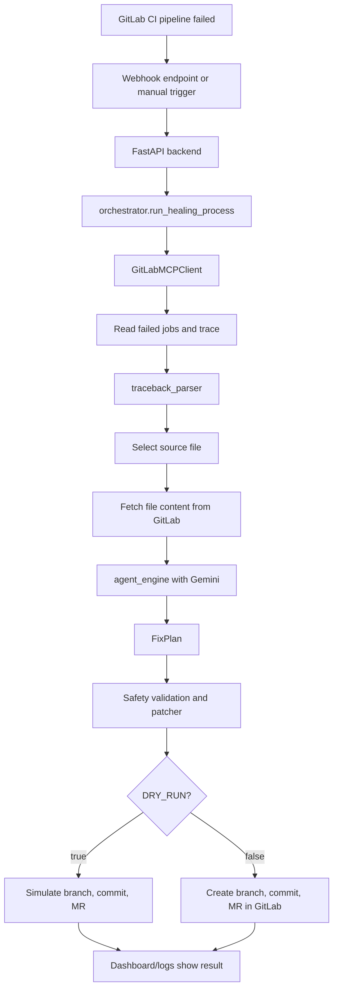

# SyntaxSentinel Workflow Guide

Dokumen ini adalah buku panduan belajar untuk memahami workflow agent
SyntaxSentinel dari nol sampai bisa membaca kode sendiri.

Fokus dokumen:

- Apa tujuan proyek ini.
- Bagaimana alur agent dari pipeline gagal sampai fix plan dibuat.
- File dan folder apa saja yang ada, fungsinya apa, dan nyambung ke mana.
- Kenapa memakai FastAPI, Pydantic, GitLab API, Vertex AI/Gemini, DRY_RUN, dan test suite.
- Istilah asing yang sering muncul.
- Error umum yang pernah muncul, kenapa terjadi, dan cara membacanya.
- Cara berpikir seperti AI Engineer/DevOps Engineer saat mengembangkan agent seperti ini.

Status terakhir saat dokumen ini dibuat:

- Backend sudah sampai Sprint 7-A.
- Test suite terakhir: 74 passed.
- DRY_RUN masih disarankan True.
- Kasus demo yang sudah berhasil:
  - SyntaxError missing colon.
  - Hard logic `is_even`.
  - Hard normalize whitespace.
- Proyek sudah demo-ready dan portfolio-ready, tetapi belum production-ready.

---

## 1. Gambaran Besar Proyek

SyntaxSentinel adalah agent yang bertugas menjadi "first responder" untuk
pipeline CI/CD yang gagal.

Dalam workflow software engineering biasa:

1. Developer push kode ke GitLab.
2. GitLab CI menjalankan test.
3. Pipeline gagal.
4. Developer membuka log job.
5. Developer membaca error.
6. Developer mencari file yang salah.
7. Developer membuat fix.
8. Developer commit fix dan membuat Merge Request.

SyntaxSentinel mencoba mengotomatisasi langkah 4 sampai 8, tetapi tetap dengan
pengaman:

- Agent tidak auto-merge.
- Agent membuat fix kecil saja.
- Agent memblokir diri jika tidak yakin.
- Agent memakai DRY_RUN saat testing agar tidak menulis ke GitLab.
- Human tetap review sebelum merge.

Cara berpikirnya:

```text
Pipeline failed
  -> read failed job
  -> read job trace
  -> extract error and file path
  -> fetch source file
  -> ask Gemini for diagnosis and fix plan
  -> validate safety
  -> create branch
  -> commit change
  -> open Merge Request
  -> human reviews
```

---

## 2. Arsitektur Tingkat Tinggi



Bagian penting:

- FastAPI menerima request.
- Orchestrator mengatur seluruh alur.
- GitLab client berbicara dengan GitLab API.
- Trace parser membaca log error.
- Agent engine memakai Gemini dan fallback lokal.
- Patcher memastikan perubahan aman.
- Dashboard hanya menampilkan/men-trigger, bukan pusat logika agent.

---

## 3. Folder Project

Struktur besar proyek:

```text
SyntaxSentinel/
  app/
    api/
    core/
    models/
    services/
    utils/
    main.py
  tests/
  frontend/
  demo-repo/
  docs/
  verify_env.py
  requirements.txt
  README.md
  .env.example
  .env
```

Penjelasan ringkas:

| Folder/File | Fungsi |
|---|---|
| `app/` | Backend utama agent. |
| `app/api/` | Endpoint HTTP FastAPI. |
| `app/core/` | Konfigurasi, logging, security helper. |
| `app/models/` | Bentuk data Pydantic untuk request/response/fix plan. |
| `app/services/` | Logika utama agent dan integrasi GitLab/Gemini. |
| `app/utils/` | Utility kecil seperti parser traceback. |
| `tests/` | Unit test dan reliability test. |
| `frontend/` | Dashboard React/Vite untuk demo visual. |
| `demo-repo/` | Repo contoh yang dipush ke GitLab untuk membuat pipeline gagal. |
| `docs/` | Dokumentasi belajar dan panduan proyek. |
| `verify_env.py` | Script untuk cek environment dan credential. |
| `.env.example` | Template env aman. |
| `.env` | Secret lokal. Jangan commit. |

---

## 4. Alur Masuk Request

Ada dua cara agent dijalankan:

1. Webhook GitLab.
2. Manual trigger.

### 4.1 Webhook GitLab

File:

```text
app/api/endpoints/webhook.py
```

Endpoint:

```text
POST /api/v1/webhook/gitlab
```

Workflow:

1. GitLab mengirim event pipeline ke backend.
2. Backend mengecek header `X-Gitlab-Token`.
3. Token dibandingkan dengan `GITLAB_WEBHOOK_SECRET`.
4. Payload GitLab divalidasi dengan Pydantic model.
5. Jika status pipeline bukan `failed`, request diabaikan.
6. Jika status pipeline `failed`, backend menjalankan `run_healing_process` sebagai background task.

Kenapa harus cek secret?

Karena endpoint webhook terbuka untuk menerima HTTP request. Tanpa secret,
siapa pun bisa memanggil endpoint dan memaksa agent membaca repo atau membuat
MR. Jadi `X-Gitlab-Token` adalah kunci sederhana agar hanya GitLab yang sah
yang boleh memicu agent.

Kenapa pakai background task?

Karena proses healing bisa lama:

- Ambil job dari GitLab.
- Ambil trace.
- Panggil Gemini.
- Validasi patch.
- Buat branch/commit/MR.

Webhook sebaiknya cepat menjawab ke GitLab dengan status accepted, lalu kerja
berjalan di belakang.

### 4.2 Manual Trigger

File:

```text
app/api/endpoints/manual.py
```

Endpoint:

```text
POST /api/v1/manual/heal-pipeline
```

Payload:

```json
{
  "project_id": 82634404,
  "pipeline_id": 2580539114,
  "ref": "hard-normalize-whitespace"
}
```

Header:

```text
X-Demo-Token: value_dari_DEMO_TOKEN
```

Workflow:

1. User/dashboard mengirim project_id, pipeline_id, dan ref.
2. Backend mengecek `X-Demo-Token`.
3. Payload divalidasi sebagai `PipelineReference`.
4. Backend menjalankan `run_healing_process` di background.
5. Endpoint mengembalikan HTTP 202 Accepted.

Kenapa ada manual trigger?

Karena saat development, webhook belum selalu mudah dipakai. Manual trigger
membuat kita bisa memilih pipeline tertentu dan menjalankan agent tanpa harus
menunggu event GitLab.

---

## 5. File Backend Inti

### 5.1 `app/main.py`

Fungsi:

- Membuat aplikasi FastAPI.
- Membaca settings.
- Mengaktifkan logging.
- Mendaftarkan router API.

Kode penting:

```python
def create_app() -> FastAPI:
    settings = get_settings()
    configure_logging(settings.log_level)

    app = FastAPI(...)
    app.include_router(api_router)
    return app
```

Nyambung ke:

- `app.api.router`
- `app.core.config`
- `app.core.logging`

Kenapa dibuat `create_app()`?

Ini pola umum FastAPI agar app mudah dibuat ulang untuk testing, deployment,
atau konfigurasi berbeda.

### 5.2 `app/api/router.py`

Fungsi:

- Mengumpulkan semua endpoint.

Isinya:

```python
api_router.include_router(system.router)
api_router.include_router(webhook.router)
api_router.include_router(manual.router)
```

Nyambung ke:

- `system.py`
- `webhook.py`
- `manual.py`

Kenapa dibuat router terpisah?

Supaya endpoint tidak numpuk di `main.py`. Semakin proyek besar, pemisahan ini
membuat struktur lebih mudah dirawat.

### 5.3 `app/api/endpoints/system.py`

Endpoint:

```text
GET /
GET /health
```

Fungsi:

- Mengecek backend hidup.
- Memberi response health sederhana.

Kenapa penting?

Saat deploy ke Cloud Run atau local dev, health endpoint dipakai untuk cek
apakah service masih hidup.

### 5.4 `app/api/endpoints/webhook.py`

Fungsi:

- Menerima webhook pipeline GitLab.
- Menolak request dengan secret salah.
- Hanya memproses pipeline yang statusnya `failed`.
- Memulai agent di background.

Nyambung ke:

- `GitLabPipelineWebhookPayload`
- `verify_shared_secret`
- `run_healing_process`

### 5.5 `app/api/endpoints/manual.py`

Fungsi:

- Menerima trigger manual dari dashboard atau command.
- Memvalidasi demo token.
- Menjalankan agent di background.

Nyambung ke:

- `PipelineReference`
- `verify_shared_secret`
- `run_healing_process`

---

## 6. Konfigurasi dan Secret

### 6.1 `app/core/config.py`

File ini mendefinisikan class `Settings`.

Contoh field:

```python
gitlab_base_url: str = "https://gitlab.com"
gitlab_personal_access_token: str = ""
gitlab_webhook_secret: str = ""
gitlab_project_id: int | None = None
gcp_project_id: str = ""
gcp_location: str = "us-central1"
gemini_model: str = ""
dry_run: bool = True
max_trace_chars: int = 4000
agent_min_confidence: float = 0.75
```

Pydantic Settings membaca `.env` otomatis.

Kenapa pakai Pydantic Settings?

Karena:

- Env variable otomatis diparse ke tipe Python.
- `GITLAB_PROJECT_ID` bisa divalidasi sebagai integer.
- `DRY_RUN=True` bisa menjadi boolean.
- Konfigurasi lebih rapi daripada `os.environ` di banyak tempat.

Contoh masalah yang pernah muncul:

```text
gitlab_project_id
Input should be a valid integer
```

Penyebab:

`.env` masih berisi placeholder:

```env
GITLAB_PROJECT_ID=PASTE_PROJECT_ID_DI_SINI
```

Solusi:

Ganti dengan angka project ID GitLab, misalnya:

```env
GITLAB_PROJECT_ID=82634404
```

### 6.2 `app/core/security.py`

Fungsi:

```python
verify_shared_secret(provided_token, expected_token)
```

Ia memakai:

```python
compare_digest
```

Kenapa tidak pakai `provided_token == expected_token`?

`compare_digest` lebih aman untuk membandingkan secret karena mengurangi risiko
timing attack. Untuk proyek portfolio mungkin terlihat kecil, tetapi ini tanda
engineering maturity.

---

## 7. Model Data

Model ada di:

```text
app/models/
```

Tujuannya:

- Memastikan request masuk punya format benar.
- Menjaga data internal agent konsisten.
- Menghindari error karena field kosong atau tipe salah.

### 7.1 `app/models/gitlab.py`

Model penting:

```python
PipelineReference
```

Dipakai manual endpoint:

```json
{
  "project_id": 82634404,
  "pipeline_id": 2580539114,
  "ref": "hard-normalize-whitespace"
}
```

Validasi:

- `project_id` harus lebih dari 0.
- `pipeline_id` harus lebih dari 0.
- `ref` tidak boleh kosong.
- `ref` otomatis di-strip.

Model lain:

- `GitLabProject`
- `GitLabPipelineAttributes`
- `GitLabPipelineWebhookPayload`

Dipakai untuk membaca webhook GitLab.

### 7.2 `app/models/agent.py`

Model penting:

```python
FixPlan
```

Inilah kontrak utama antara Gemini/agent dan orchestrator.

Field penting:

| Field | Arti |
|---|---|
| `root_cause` | Penyebab utama error. |
| `error_type` | Jenis error, misalnya SyntaxError atau AssertionError. |
| `file_to_modify` | File yang boleh diubah. |
| `original_snippet` | Potongan kode lama. |
| `fixed_snippet` | Potongan kode baru. |
| `full_fixed_file_content` | Isi penuh file setelah diperbaiki, opsional. |
| `confidence_score` | Skor keyakinan 0.0 sampai 1.0. |
| `risk_level` | low, medium, atau high. |
| `should_create_merge_request` | Boleh lanjut buat MR atau tidak. |

Kenapa perlu model ini?

Karena LLM seperti Gemini bisa menghasilkan jawaban yang tidak konsisten.
Dengan `FixPlan`, kita memaksa output agent punya struktur yang jelas.

Kalau Gemini menjawab ngawur, validasi Pydantic akan gagal dan agent tidak akan
lanjut membuat patch berbahaya.

---

## 8. Orchestrator: Otak Alur Kerja

File:

```text
app/services/orchestrator.py
```

Ini file paling penting untuk memahami agent.

Fungsi utama:

```python
run_healing_process(project_id, pipeline_id, ref)
```

Alur lengkap:

1. Ambil settings dari `.env`.
2. Buka GitLab client.
3. Ambil failed jobs dari pipeline.
4. Pilih job yang relevan.
5. Ambil job trace.
6. Trim trace agar tidak terlalu panjang.
7. Extract candidate file paths.
8. Extract Python error summary.
9. Pilih source file yang aman.
10. Ambil isi file dari GitLab.
11. Panggil agent engine untuk membuat fix plan.
12. Validasi fix plan.
13. Bangun fixed content.
14. Validasi patch size.
15. Buat GitLab update action.
16. Buat branch.
17. Commit perubahan.
18. Buat Merge Request.
19. Return result.

Versi ringkas kode:

```python
failed_jobs = await gitlab.get_failed_jobs(project_id, pipeline_id)
failed_job = _select_failed_job(failed_jobs)
raw_trace = await gitlab.read_job_trace(project_id, job_id)
candidate_paths = extract_candidate_file_paths(job_trace)
error_summary = extract_python_error_summary(job_trace)
source_file_path = _select_source_file(candidate_paths, error_summary)
source_code = await gitlab.get_file_content(project_id, source_file_path, ref)
fix_plan = await analyze_and_plan_fix(job_trace, source_file_path, source_code)
validation_error = _validate_fix_plan(...)
fixed_content = _build_fixed_content(source_code, fix_plan)
action = build_gitlab_update_action(source_file_path, fixed_content)
branch = await gitlab.create_branch(...)
commit = await gitlab.commit_file_changes(...)
merge_request = await gitlab.create_merge_request(...)
```

### 8.1 Kenapa namanya orchestrator?

Dalam sistem agent, orchestrator adalah pengatur alur.

Ia bukan yang menganalisis error secara mendalam. Ia juga bukan yang langsung
memanggil API detail. Tugasnya mengoordinasikan semua komponen.

Analogi:

- Orchestrator = manajer workflow.
- GitLab client = tangan untuk mengambil/menulis data GitLab.
- Trace parser = mata untuk membaca log.
- Agent engine = otak reasoning.
- Patcher = petugas safety patch.

### 8.2 `_select_failed_job`

Fungsi:

Memilih failed job yang paling relevan.

Ia memprioritaskan job dengan kata:

```text
test, pytest, lint, build
```

Kenapa?

Pipeline bisa punya banyak job. Untuk MVP, job test/lint/build biasanya paling
informatif untuk auto-fix.

### 8.3 `_select_source_file`

Fungsi:

Menentukan file mana yang seharusnya diperbaiki.

Kasus menarik:

Trace pytest sering menunjuk ke file test:

```text
test_app.py:13: AssertionError
```

Tetapi file yang perlu diperbaiki biasanya `app.py`, bukan `test_app.py`.

Maka orchestrator punya logika:

```text
Jika error AssertionError dan file path adalah test file:
  - pilih non-test path jika ada
  - kalau tidak ada, infer test_app.py -> app.py
```

Kenapa ini penting?

AI agent yang terlalu mudah mengubah test bisa berbahaya. Banyak agent buruk
"memperbaiki" test agar pass, padahal bug ada di source code. SyntaxSentinel
lebih aman karena mencoba memperbaiki source, bukan test.

### 8.4 `_validate_fix_plan`

Fungsi:

Memastikan fix plan aman sebelum patch dibuat.

Validasi:

- `should_create_merge_request` harus True.
- `confidence_score` harus di atas `agent_min_confidence`.
- `file_to_modify` harus sama dengan source file yang dipilih.
- `risk_level` tidak boleh high.
- File harus masuk scope aman.
- Patch harus punya isi yang cukup.

Jika gagal, status menjadi:

```text
safety_blocked
```

Ini bukan bug. Ini rem pengaman.

---

## 9. GitLab MCP-Style Client

File:

```text
app/services/gitlab_mcp_client.py
```

Nama "MCP-style" berarti interface-nya dibuat seperti kumpulan tool:

- `list_pipeline_jobs`
- `get_failed_jobs`
- `read_job_trace`
- `get_file_content`
- `create_branch`
- `commit_file_changes`
- `create_merge_request`
- `add_merge_request_note`
- `get_project`

Saat ini implementasinya memakai GitLab REST API v4 lewat `httpx.AsyncClient`.

Kenapa tidak langsung panggil GitLab API di orchestrator?

Supaya orchestrator tidak tahu detail URL GitLab.

Contoh buruk:

```python
await httpx.get("https://gitlab.com/api/v4/projects/...")
```

kalau tersebar di banyak file, akan sulit dirawat.

Dengan client:

```python
await gitlab.get_failed_jobs(project_id, pipeline_id)
```

orchestrator lebih mudah dibaca.

### 9.1 DRY_RUN

DRY_RUN adalah mode simulasi.

Jika:

```env
DRY_RUN=True
```

maka fungsi write tidak benar-benar menulis ke GitLab.

Contoh:

```python
create_branch()
commit_file_changes()
create_merge_request()
```

akan mengembalikan data simulasi:

```json
{
  "dry_run": true,
  "id": "dry-run-commit"
}
```

Kenapa DRY_RUN penting?

Karena agent AI bisa salah. Saat belajar dan testing, kita ingin agent boleh
berpikir dan merancang fix, tetapi belum boleh mengubah repo sungguhan.

### 9.2 Error GitLab

Custom exception:

| Error | Arti |
|---|---|
| `GitLabAuthenticationError` | Token salah, expired, atau scope kurang. |
| `GitLabNotFoundError` | Project/pipeline/job/file tidak ditemukan. |
| `GitLabRateLimitError` | GitLab membatasi request. |
| `GitLabAPIError` | Error umum GitLab atau network. |

Contoh:

```text
404 Not found
```

Kemungkinan penyebab:

- Project ID salah.
- Pipeline ID bukan milik project itu.
- Token tidak punya akses.
- Branch/ref salah.

Contoh:

```text
GitLab transport error: ConnectError
```

Kemungkinan penyebab:

- Internet/DNS bermasalah.
- GitLab tidak bisa dijangkau.
- Python environment berbeda atau proxy/network issue.

Ini bukan selalu bug agent. Kadang murni jaringan.

---

## 10. Traceback Parser

File:

```text
app/utils/traceback_parser.py
```

Tugas:

- Memotong trace panjang.
- Mengambil path file kandidat.
- Mengambil error summary.
- Mengabaikan path yang tidak aman seperti `.venv` dan `site-packages`.

### 10.1 Apa itu traceback?

Traceback adalah jejak error Python.

Contoh:

```text
Traceback (most recent call last):
  File "/builds/user/project/app.py", line 1
    def add(a: int, b: int) -> int
SyntaxError: expected ':'
```

Traceback memberi tahu:

- File apa yang error.
- Baris berapa.
- Error type apa.
- Pesan error apa.

### 10.2 `extract_candidate_file_paths`

Fungsi:

Mencari file seperti:

```text
app.py
test_app.py
tests/test_app.py
requirements.txt
pyproject.toml
package.json
```

Kenapa harus extract path?

Karena agent harus tahu file mana yang akan diambil dari GitLab.

### 10.3 `extract_python_error_summary`

Output contoh:

```python
{
    "error_type": "SyntaxError",
    "file_path": "app.py",
    "line_number": 2,
    "message": "expected ':'",
}
```

Jenis error yang didukung:

- SyntaxError
- ModuleNotFoundError
- ImportError
- AssertionError
- Generic Error/Exception
- UnknownError

### 10.4 Kenapa parser harus kuat?

Log GitLab sering punya prefix:

```text
2026-06-05T16:36:23.269060Z 01O E       assert False is True
```

Kalau parser hanya mencari baris yang dimulai `E`, ia gagal.

Itu sebabnya S7-A menambahkan normalisasi prefix log.

---

## 11. Agent Engine dan Gemini

File:

```text
app/services/agent_engine.py
```

Tugas:

- Membuat prompt untuk Gemini.
- Memanggil Vertex AI/Gemini.
- Meminta output JSON berbentuk `FixPlan`.
- Memvalidasi output Gemini.
- Jika Gemini gagal memberi JSON valid, mencoba fallback deterministik.
- Jika tetap tidak aman, mengembalikan safe failure.

### 11.1 Kenapa pakai Gemini?

Karena log error dan source code bisa membutuhkan reasoning.

Contoh:

```text
assert 'Syntax   Sentinel' == 'Syntax Sentinel'
```

Manusia paham bahwa extra spaces harus di-collapse. Gemini membantu membaca
hubungan antara test failure, kode, dan perbaikan.

### 11.2 Prompt

Prompt dibuat di:

```python
_build_user_prompt(...)
```

Isi prompt:

- Job trace.
- Candidate file path.
- Source code.
- JSON schema `FixPlan`.
- Instruksi hanya return JSON.

Kenapa memberi schema?

LLM perlu kontrak output. Tanpa schema, Gemini bisa menjawab dengan paragraf
panjang, markdown, atau format tidak konsisten.

### 11.3 JSON Parsing

Problem umum:

LLM kadang menjawab:

```text
Here is the JSON:
```json
{ ... }
```
```

atau bahkan:

```text
Gemini analysis:
{not valid json}
{ valid json here }
```

Karena itu S7-A memperkuat:

```python
_extract_json_object
_loads_first_json_object
_iter_balanced_json_objects
_normalize_fix_plan_payload
```

Tujuannya:

- Ambil JSON valid walau ada teks tambahan.
- Jangan langsung gagal kalau field memakai alias seperti `confidence`.
- Tetap validasi akhir dengan Pydantic.

### 11.4 Fallback Deterministik

Fallback deterministik berarti:

Agent punya rule lokal yang sempit dan aman, tanpa menunggu Gemini.

Contoh fallback:

1. Missing colon:

```python
def add(a: int, b: int) -> int
```

menjadi:

```python
def add(a: int, b: int) -> int:
```

2. Parity assertion:

```python
def is_even(number: int) -> bool:
    return number % 2 == 1
```

menjadi:

```python
def is_even(number: int) -> bool:
    return number % 2 == 0
```

Kenapa fallback dibuat sempit?

Karena fallback yang terlalu pintar bisa berbahaya. Rule lokal hanya boleh
memperbaiki pola yang sangat jelas.

### 11.5 Safe Failure

Jika Gemini gagal dan fallback tidak cocok, agent membuat:

```python
_safe_failure(...)
```

Hasilnya:

```json
{
  "risk_level": "high",
  "confidence_score": 0.0,
  "should_create_merge_request": false
}
```

Ini akan berhenti di orchestrator sebagai `safety_blocked`.

---

## 12. Patcher dan Safety

File:

```text
app/services/patcher.py
```

Tugas:

- Mengganti snippet lama dengan snippet baru.
- Memastikan file yang diubah boleh diubah.
- Memastikan patch tidak terlalu besar.
- Membuat GitLab commit action.

### 12.1 `replace_exact_snippet`

Fungsi:

Mengganti `original_snippet` dengan `fixed_snippet`.

Aturan:

- Original snippet tidak boleh kosong.
- Fixed snippet tidak boleh kosong.
- Original snippet harus ditemukan.
- Original snippet tidak boleh muncul lebih dari sekali.

Kenapa snippet tidak boleh ambigu?

Jika snippet muncul dua kali, agent tidak tahu bagian mana yang harus diubah.
Daripada salah patch, lebih baik safety block.

### 12.2 `validate_file_scope`

File yang boleh:

- `.py`
- `requirements.txt`
- `package.json`
- `pyproject.toml`

File yang ditolak:

- `.git`
- `.venv`
- `venv`
- `site-packages`
- `__pycache__`
- absolute path
- path dengan `..`

Kenapa?

Agent tidak boleh mengubah file sensitif, dependency environment, atau path di
luar repo.

### 12.3 `validate_patch_size`

Policy:

- Patch tidak boleh kosong.
- Patch tidak boleh binary.
- Patch tidak boleh terlalu banyak baris.
- Patch tidak boleh rewrite file terlalu besar.

Ini penting karena MVP agent hanya boleh small safe fix.

---

## 13. Status Output Agent

Hasil `run_healing_process` bisa punya beberapa status.

### 13.1 `merge_request_created`

Artinya agent berhasil sampai tahap membuat branch/commit/MR.

Jika `DRY_RUN=True`, itu simulasi.

Contoh:

```json
{
  "status": "merge_request_created",
  "dry_run": true
}
```

### 13.2 `no_failed_jobs`

Artinya pipeline yang diberikan tidak punya failed job.

Penyebab umum:

- Pipeline ID salah.
- Pipeline sudah success.
- Kamu memilih pipeline lama yang bukan branch failure.

### 13.3 `safety_blocked`

Artinya agent sengaja berhenti demi keamanan.

Penyebab umum:

- Tidak menemukan file aman.
- Confidence terlalu rendah.
- Risk high.
- Gemini menolak create MR.
- Patch terlalu besar.
- Snippet tidak cocok.

Ini bukan selalu error buruk. Dalam agent safety, berhenti saat tidak yakin
adalah perilaku yang benar.

### 13.4 `gitlab_error`

Artinya komunikasi dengan GitLab gagal.

Contoh:

- 401/403: token salah atau scope kurang.
- 404: project/pipeline/job/file tidak ditemukan.
- 429: rate limit.
- ConnectError: network/DNS.

### 13.5 `error`

Artinya ada exception tidak terduga.

Untuk production, status ini harus dikurangi dengan error handling lebih kuat.

---

## 14. Frontend Dashboard

Folder:

```text
frontend/
```

File penting:

```text
frontend/src/App.jsx
frontend/src/main.jsx
frontend/src/index.css
frontend/package.json
```

Dashboard bukan otak agent. Dashboard adalah tampilan demo.

Fungsi:

- Menampilkan status latest run.
- Menampilkan timeline agent activity.
- Menampilkan diagnosis.
- Menampilkan fix plan.
- Menampilkan MR/pipeline link.
- Memberi form manual trigger.

### 14.1 Kenapa backend base URL pakai `VITE_API_BASE_URL`?

Karena frontend bisa berjalan di port berbeda dari backend.

Contoh:

```env
VITE_API_BASE_URL=http://127.0.0.1:8000
```

Dengan env, frontend tidak hardcode URL.

### 14.2 Kenapa ada mock data fallback?

Saat backend mati, dashboard tetap bisa demo visual.

Ini berguna untuk portfolio presentation:

- UI tetap terlihat.
- Alur agent tetap bisa dijelaskan.
- Tidak tergantung GitLab/GCP online setiap saat.

---

## 15. Demo Repo

Folder:

```text
demo-repo/
```

Isi utama:

```text
app.py
test_app.py
.gitlab-ci.yml
requirements.txt
```

Demo repo dipakai untuk menciptakan pipeline gagal secara terkendali.

Contoh branch:

- `dry-run-syntax-error`
- `hard-logic-is-even`
- `hard-normalize-whitespace`

Kenapa perlu demo repo?

Agent CI/CD butuh pipeline GitLab nyata. Daripada mengetes di project penting,
kita buat repo kecil yang aman untuk dirusak.

---

## 16. Test Suite

Folder:

```text
tests/
```

Test saat ini memverifikasi:

- Endpoint system.
- Endpoint webhook.
- Endpoint manual.
- GitLab client.
- Agent engine.
- Orchestrator.
- Patcher safety.
- Traceback parser.
- Models.

Kenapa test penting?

Agent AI tidak cukup hanya berhasil sekali demo. Ia harus stabil saat format
error berubah.

Contoh bug yang pernah muncul:

```text
Gemini fix plan parsing failed
Healing process blocked by safety policy
```

Lalu S7-A menambahkan test agar:

- JSON Gemini yang berisik tetap bisa diparse.
- GitLab trace prefix tetap terbaca.
- Pytest short summary tetap terbaca.
- Parity fallback tetap bekerja.

### 16.1 Cara menjalankan test

Dari root project:

```powershell
.\.venv\Scripts\Activate.ps1
python -m pytest
```

Jika `python` tidak dikenali, pakai:

```powershell
.\.venv\Scripts\python.exe -m pytest
```

---

## 17. Verify Environment

File:

```text
verify_env.py
```

Fungsi:

- Mengecek env wajib.
- Mengecek token GitLab.
- Mengecek konfigurasi Vertex AI.
- Mengecek Google ADC.
- Memberi warning jika DRY_RUN aktif.

Output bagus:

```text
Summary
[OK] Environment is ready for SyntaxSentinel development.
```

### 17.1 ADC

ADC = Application Default Credentials.

Ini credential lokal Google Cloud untuk library Python.

Dibuat dengan:

```powershell
gcloud auth application-default login
```

Jika belum ada, error bisa muncul:

```text
DefaultCredentialsError
Application Default Credentials unavailable
```

Artinya Gemini/Vertex AI belum bisa dipanggil dari lokal.

---

## 18. Istilah Penting

### CI/CD

CI/CD adalah proses otomatis untuk test, build, dan deploy.

CI = Continuous Integration.
CD = Continuous Delivery/Deployment.

Di proyek ini, GitLab CI menjalankan pytest setiap kali branch dipush.

### Pipeline

Pipeline adalah rangkaian job CI/CD.

Contoh:

```text
install dependencies -> run pytest -> build image
```

### Job

Job adalah satu langkah dalam pipeline.

Contoh:

```text
pytest
```

Jika job pytest gagal, pipeline menjadi failed.

### Trace / Job Trace

Trace adalah log output dari job.

Di sinilah ada error message, traceback, dan assertion diff.

### Ref

Ref adalah branch atau tag yang dipakai pipeline.

Contoh:

```text
hard-normalize-whitespace
```

### Merge Request

Merge Request adalah permintaan untuk menggabungkan branch fix ke target branch.

Agent membuat MR, tetapi human tetap review.

### DRY_RUN

Mode simulasi.

Jika True:

- Agent membaca GitLab.
- Agent menganalisis error.
- Agent membuat fix plan.
- Agent mensimulasikan branch/commit/MR.
- Tidak ada write operation sungguhan.

Jika False:

- Agent benar-benar create branch.
- Agent benar-benar commit.
- Agent benar-benar create MR.

### Confidence Score

Skor keyakinan agent.

Contoh:

```text
0.98
```

Semakin dekat 1.0, semakin yakin.

Tetapi confidence bukan jaminan benar. Tetap perlu validation dan human review.

### Risk Level

Tingkat risiko fix.

Nilai:

- low
- medium
- high

Policy saat ini memblokir `high`.

### Safety Block

Safety block berarti agent berhenti demi keamanan.

Ini harus dilihat sebagai fitur, bukan kegagalan total.

### Fallback Deterministik

Fallback lokal berbasis rule sempit.

Contoh:

- Tambah colon saat SyntaxError jelas.
- Perbaiki modulo parity saat test boolean sangat jelas.

### LLM

LLM = Large Language Model.

Gemini adalah LLM yang dipakai agent untuk reasoning.

### Vertex AI

Layanan Google Cloud untuk menjalankan model AI, termasuk Gemini.

### MCP-Style

MCP = Model Context Protocol.

Di proyek ini `GitLabMCPClient` belum memakai MCP server resmi, tetapi dibuat
dengan gaya tool interface agar nanti mudah diganti.

---

## 19. Error Yang Pernah Muncul dan Artinya

### 19.1 `Input should be a valid integer`

Contoh:

```text
gitlab_project_id
Input should be a valid integer
```

Penyebab:

`.env` berisi placeholder, bukan angka.

Solusi:

Isi:

```env
GITLAB_PROJECT_ID=82634404
```

### 19.2 `404 Not found`

Contoh:

```text
GitLabNotFoundError: 404 Not found
```

Penyebab:

- Project ID salah.
- Pipeline ID salah.
- Pipeline ID dari project lain.
- Ref/branch tidak ada.
- Token tidak punya akses.

Cara cek:

```powershell
Invoke-RestMethod -Headers @{ "PRIVATE-TOKEN" = $token } `
  -Uri "https://gitlab.com/api/v4/projects/$projectId"
```

### 19.3 `no_failed_jobs`

Contoh:

```json
{
  "status": "no_failed_jobs"
}
```

Penyebab:

Pipeline yang dipilih success, bukan failed.

Solusi:

Ambil pipeline failed terbaru untuk branch yang benar.

### 19.4 `Gemini fix plan parsing failed`

Penyebab:

Gemini mengembalikan output bukan JSON valid.

Contoh:

```text
Here is the fix:
{ ... }
```

atau JSON tidak lengkap.

S7-A memperkuat parser agar lebih tahan terhadap output seperti ini.

### 19.5 `safety_blocked`

Contoh:

```json
{
  "status": "safety_blocked",
  "reason": "Gemini declined to create a merge request for this failure."
}
```

Artinya:

Agent sengaja tidak membuat patch.

Penyebab umum:

- Gemini tidak yakin.
- Output Gemini gagal diparse dan fallback tidak cocok.
- File tidak aman.
- Patch terlalu besar.
- Confidence rendah.

### 19.6 `ConnectError`

Contoh:

```text
GitLab transport error: ConnectError
getaddrinfo failed
```

Penyebab:

- Internet/DNS bermasalah.
- GitLab tidak reachable.
- Environment Python berbeda.

Catatan:

Ini biasanya bukan bug logic agent.

### 19.7 Vertex AI SDK Deprecated Warning

Contoh:

```text
vertexai.generative_models is deprecated
```

Artinya:

Library yang dipakai masih bekerja, tetapi Google memberi warning bahwa API ini
akan dihentikan di masa depan.

Solusi jangka panjang:

Migrasi ke Google Gen AI SDK atau API terbaru yang direkomendasikan Google.

Untuk demo saat ini:

Warning ini non-fatal.

---

## 20. Workflow Testing Manual

### 20.1 Cek env

```powershell
cd "D:\PROYEK ML DAN AI\SyntaxSentinel"
.\.venv\Scripts\Activate.ps1
python verify_env.py
```

Pastikan:

```text
[OK] Environment is ready for SyntaxSentinel development.
```

### 20.2 Pastikan DRY_RUN

```powershell
Select-String -Path ".env" -Pattern "DRY_RUN"
```

Disarankan:

```text
DRY_RUN=True
```

### 20.3 Jalankan agent ke pipeline tertentu

```powershell
python -c "import asyncio,json; from app.services.orchestrator import run_healing_process; result=asyncio.run(run_healing_process(82634404, 2580539114, 'hard-normalize-whitespace')); print(json.dumps(result, indent=2, default=str))"
```

Output sukses:

```json
{
  "status": "merge_request_created",
  "dry_run": true
}
```

### 20.4 Jalankan backend

```powershell
uvicorn app.main:app --reload
```

Buka:

```text
http://127.0.0.1:8000/
http://127.0.0.1:8000/health
```

### 20.5 Jalankan frontend

```powershell
cd frontend
npm run dev
```

Buka:

```text
http://127.0.0.1:5173
```

---

## 21. Workflow Belajar Kode

Kalau ingin memahami proyek ini dari kode, urutan bacanya:

1. `README.md`
2. `app/main.py`
3. `app/api/router.py`
4. `app/api/endpoints/manual.py`
5. `app/api/endpoints/webhook.py`
6. `app/services/orchestrator.py`
7. `app/services/gitlab_mcp_client.py`
8. `app/utils/traceback_parser.py`
9. `app/services/agent_engine.py`
10. `app/services/patcher.py`
11. `app/models/agent.py`
12. `tests/test_orchestrator.py`
13. `tests/test_agent_engine.py`
14. `tests/test_traceback_parser.py`
15. `frontend/src/App.jsx`

Kenapa urutan ini?

Karena mulai dari pintu masuk HTTP, lalu ke workflow utama, lalu ke komponen
pendukung, lalu ke test.

---

## 22. Kenapa Desainnya Begini?

### 22.1 Kenapa bukan semua logic di satu file?

Karena agent akan cepat rumit.

Kalau semua logic ada di satu file:

- Susah dites.
- Susah debug.
- Susah ganti GitLab client.
- Susah ganti Gemini SDK.
- Susah tambah safety.

Dengan pemisahan:

- API hanya menerima request.
- Orchestrator mengatur workflow.
- GitLab client mengurus API.
- Agent engine mengurus reasoning.
- Patcher mengurus safety patch.
- Parser mengurus log.

### 22.2 Kenapa safety lebih penting daripada "selalu fix"?

Agent yang selalu mencoba fix bisa berbahaya.

Dalam real project, salah fix bisa:

- Mengubah logic bisnis.
- Menghapus validasi penting.
- Mengubah test agar pass palsu.
- Membuat bug baru.

Maka prinsip SyntaxSentinel:

```text
Jika tidak yakin, berhenti.
```

### 22.3 Kenapa human review tetap wajib?

Karena AI tidak punya konteks penuh bisnis.

Agent boleh mempercepat:

- membaca log
- membuat diagnosis
- menyarankan patch
- membuat MR

Tetapi keputusan merge tetap manusia.

### 22.4 Kenapa test suite terus ditambah?

Karena agent reliability tidak bisa dibuktikan dengan satu demo.

Setiap kali agent gagal pada format error baru, kita ubah kegagalan itu menjadi
test. Ini cara engineering yang benar:

```text
bug ditemukan -> buat test yang gagal -> fix -> test hijau
```

---

## 23. Batasan Saat Ini

Yang sudah kuat:

- Basic FastAPI backend.
- Manual trigger.
- Webhook trigger.
- GitLab API read/write layer.
- DRY_RUN safety.
- Gemini fix plan.
- JSON repair.
- Deterministic fallback untuk beberapa pola.
- Patch scope validation.
- Patch size validation.
- Dashboard demo.
- Test suite 74 passed.

Yang belum production-ready:

- Belum ada sandbox execution untuk mengetes hasil patch sebelum MR asli.
- Belum ada persistent audit log database.
- Belum ada queue/worker production.
- Belum ada rate limit endpoint.
- Belum ada GitLab webhook deployment Cloud Run penuh.
- Belum migrasi Vertex AI SDK deprecated.
- Belum ada multi-file patch safety.
- Belum ada allowlist per repository.
- Belum ada approval workflow untuk DRY_RUN=False.

---

## 24. Sprint Berikutnya Yang Masuk Akal

### S7-B: Safety Before Real MR

Tujuan:

Sebelum membuat MR asli, agent harus memvalidasi patch lebih jauh.

Isi:

- Preflight validation.
- Simulasi patch lokal.
- Optional run pytest sandbox.
- Status `validation_failed`.
- Dokumentasi hasil validation.

### S8: Observability

Tujuan:

Agent punya log aktivitas yang lebih enak dibaca.

Isi:

- Structured event timeline.
- Save latest run.
- Dashboard mengambil status real.
- Better error display.

### S9: Deployment Preparation

Tujuan:

Siapkan Cloud Run.

Isi:

- Dockerfile.
- Secret Manager.
- Cloud Run env.
- GitLab webhook URL.

---

## 25. Mental Model Untuk Menjadi AI Engineer

Proyek ini bukan sekadar "pakai Gemini".

Skill yang sedang dilatih:

1. Membaca failure dari sistem nyata.
2. Mengubah log mentah menjadi struktur.
3. Mendesain kontrak output LLM.
4. Memvalidasi output LLM.
5. Membuat fallback deterministik.
6. Menambahkan safety policy.
7. Menulis test untuk reliability.
8. Menghubungkan AI dengan workflow DevOps.
9. Menjaga manusia tetap di loop.

AI Engineer yang bagus bukan hanya bisa membuat prompt.

AI Engineer yang bagus bisa membuat sistem AI:

- bisa gagal dengan aman,
- bisa dijelaskan,
- bisa dites,
- bisa diamati,
- dan tidak merusak production saat model salah.

SyntaxSentinel sudah mengarah ke sana.

---

## 26. Ringkasan Super Singkat

Jika harus dijelaskan dalam satu paragraf:

SyntaxSentinel adalah FastAPI backend yang menerima pipeline failed dari GitLab
atau manual trigger, mengambil failed job dan trace lewat GitLab API, mem-parse
error untuk menemukan file sumber, meminta Gemini membuat diagnosis dan fix
plan, memvalidasi keamanan patch, lalu membuat branch/commit/MR atau simulasi
DRY_RUN. Semua output Gemini dipaksa menjadi `FixPlan`, patch dibatasi oleh
safety rule, dan test suite memastikan agent tidak mudah rusak saat format
error berubah.

